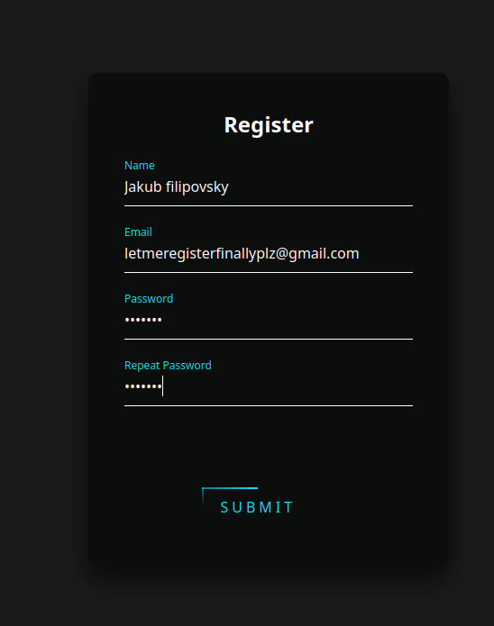
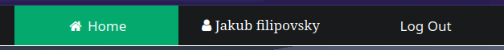
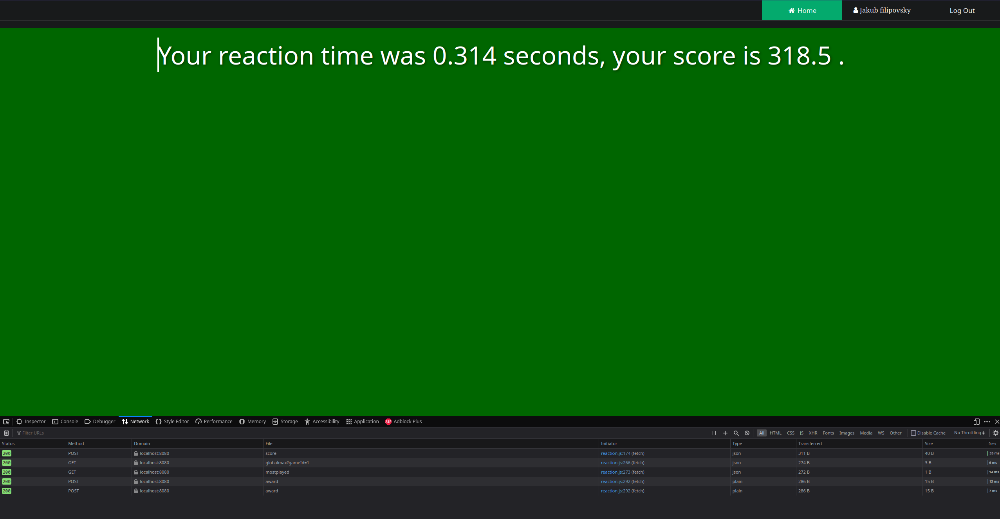
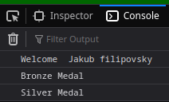
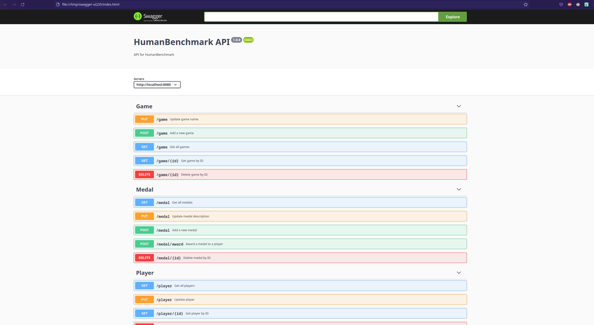

## Name
Human benchmark

## Description
Application that aims to measure your cognitive abilites and speed.
Stores user scores, tracks your progress and allows you to compete with others on the 
global leaderboards.

## Client side
The client side will be realized as a dynamic website using html/css. Usage of a fancy JS frontend framework is  under consideration. The users will be greeted with a choice of multiple games and the option to log in / register on the side bar. Playing a game will result in a score that will be analysed and sent to the database.


## Database schema
<small>Highscore private key is a combination of coresponding game and user private keys and that combination is unique, which is what we expect from a user and his highscore for a single game.</small>


## Complex database query
Select the user with the most played games / with the highest amount of medals

## Complex operation
- Sending a score (Insert into db, read the highscore, if new score is higher then update the highscore)
- Comparison to other players (Find the highscore of every player, calculate percentile, show it to the player)
- Creating an account / changing a password (Check if email/ username is already present then create. Compare hashed password before updating)

## Setup
- Clone repository : 
``` git clone https://gitlab.fit.cvut.cz/filipj25/bi-tjv-semestral.git```
- Run a psql database on port 5432 with user Postgres and password pass or with any configuration you want but then edit HumanBenchmark/src/main/resources/application.properties and .../test/...application-test.properties accordingly : 
```docker run --name db -e POSTGRES_PASSWORD=pass -e POSTGRES_DB=db -p 5432:5432 -d postgres ```
- Create databases db and testdb : ``` docker exec -it db psql -U postgres ```
- ```CREATE DATABASE db; CREATE DATABASE testdb;``` 
- Build and run the app : ``` cd HumanBenchmark; ./gradlew build; ./gradlew bootRun ```
- Open the index.html page : ``` firefox ../frontend/index.html```
## Usage
1) Register an account to access the db features, any data will be ok, however email must contain the @ symbol, password will be hashed.



2) From now on you will be logged in and the session will be stored via cookies



3) Click one the reaction test icon and play the game, press F12 to check the api calls



4) Check your medals achieved in the console tab 



5) Documentation is available at HumanBenchmark/src/main/resources/HumanBenchmark.yaml




## Disclaimer
Heavily inspired by https://humanbenchmark.com/
